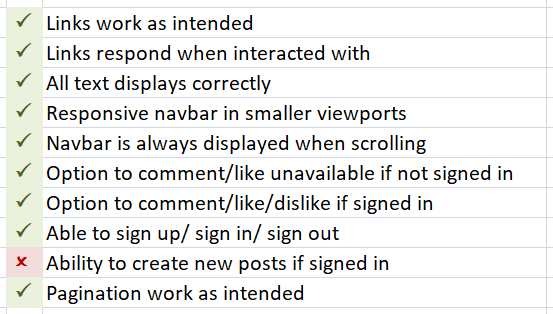

# BOOK CLUB 2

For my Milestone Project #4 on Code Institute's Diploma in Software Developement course I have created a blog, called Book Club. The blog is used to post reviews about books. All users can read the preview of the reviews on the main page and then be redirected to another page with the full review clicking on the 'Read more' button. If the user is registered and currently logged in, he can have access to leave a comment or like/dislike a post.

You can check the blog page clicking [HERE](https://book-club2.herokuapp.com/)

## Features

### Code features

* Created in Django using Gitpod.
* Deployed in Heroku for online interaction.

### User features

* Home button, on the navigation bar at the top left, bringing the user back to the home page.
* About button, on the navigation bar at the top left, leading the user to a new page containing information about how the blog was created.
* Option to register/sign in on the blog clicking on the respective button from the navigation bar on the top left.

* Option to log out by clicking on the respective button from the navigation bar on the top left.

* Once registered/logged in, user can interact with the blog, leaving a new comment or like/dislike posts on the post page.

* Warning message is shown when user log in/out or leave a comment.

* Read more button, on botton of every post, giving the user the possibility of reading the full review.

## Technologies used

* Django
* Gitpod as IDE
* Git for version control
* GitHub to storage files
* Cloudinary to storage media
* Heroku for deployment

## Resources

* [Code Institute](https://codeinstitute.net/ie/) - course materials, Slack community and tutor/mentor support
* [Boostrap docs](https://getbootstrap.com/) - for material support
* [Django central](https://djangocentral.com/) - for inspiration and material support
* [Codemy.com](https://www.youtube.com/c/Codemycom) - youtube channel for material support
* [W3 Schools](https://www.w3schools.com/) - for material support

## Credits

### Content
* Book reviews from [Goodreads](https://www.goodreads.com/) website.

## User Stories

### As Visitor:

* I want to be able to navigate through the website.

All pages are accessible to all visitors on the blog.

* I want to know how the blog was created.

All users can have access to the About us page.

* I want to read the book reviews.

The pages with full reviews are accessible to all users clicking on the button ‘Read more’ at the Home page. The user can read the review, see the book cover, see the number of likes, and read the comments left from registered users.

* I want to make comments and like the posts.

This option is only available for registered users.

* I want to leave a review

This option is only available for the blog admin.

### As Registered User:

* I want to be able to navigate through the website.

All pages are accessible to all visitors on the blog.

* I want to know how the blog was created.

All users can have access to the About us page.

* I want to read the book reviews.

The pages with full reviews are accessible to all users clicking on the button ‘Read more’ at the Home page. The user can read the review, see the book cover, see the number of likes, and read the comments left from registered users.

* I want to make comments and like the posts.

This option is available when the user is logged in to the blog, by accessing the book review page. The button to like the book review is just after the text, followed by the comment field.

* I want to leave a review.

This option is only available for the blog admin.

## Testing

### Manual Testing

* Manual tests done as admin user, regular user and visitant. In all scenarios the blog funcionalities worked without showing any issues.
* I also send the live link to friends and family members for testing and feedback.

Manual testing result:

### Accessibility Testing

* Tested using [Accessibility Test](https://accessibilitytest.org/) and the result is as follow:

## Bugs/Issues *(from 1st repository)*

* Gitignore

When setting up all files and folders I forgot to include the .gitignore. So, when at some stage on my commitments I received and warning email from GitHub about my keys being exposed.  
*To Fix: No support needed - I just created a new file, added the necessary content on it and then commit/push to Github.*

* Login on Django Admin

When setting the supper user I was having trouble to access the Django Admin page. The url was returning an error message.  
*To Fix: Needed support from Tutor - The server was not running. I was told to run the server and use the url https://8000-rlorimier-bookclub-fa25pzry77q.ws-eu63.gitpod.io/admin/.*

* Hyperlinks not working

The pages were not extending the 'base.html'  
*To Fix: Needed support from Tutor - I was told to include on the top of every page 'load static' and it worked*

* New comment does not show

When adding a new comment (logged in and/or out), the page is reloaded and redirected correctly with no error messages, however the comment is not saved and does not appear on the website neither on the blog admin server.  
*To Fix: No support needed (although I tried to discuss this issue with my mentor but the time was not enough) - This is the issue that took longer to be solved. I searched on web for different tutorials but any of them seemed to be helpfull. After a while, I just needed to add 'data' on views.py, line 55*

* New post show error message

When adding a new post (only logged users), it shows and error message  
*To Fix: No support needed - I was using the same function for both, edit and create a new post. I decided to make it individualy and then it starts to work*

* GET /favicon.ico HTTP/1.1" 404 179

The terminal keeps showing this error from time to time and I can not find a solution or even where is comming from, as I did not add any favicon on the blog.   *BUG NOT FIXED*

* Push failed on Heroku

When pushing my gitpod project to Heroku, following the instructions for: DEBUG=False and excluding DISABLE_COLLECTSTATIC=1, an error message is shown. I tried help from my mentor and from the tutor support but none of them were able to help me to find a solution for it. So, I left the DEBUG as False on my code and added again the DISABLE_COLLECTSTATIC=1 and tried to puch my code again. The push worked this time, however the css file is not being loaded. All funcionalities seems to work fine on the manual tests, but the css.   *BUG NOT FIXED*

## Bugs/Issues *(from 2nd repository)*

## Creating a Repository and Deploying
The steps to create a new repository:

Logged in my GitHub page and accessed Code Institute GitHub page. Selected python-essencials-template and clicked in Use This Template. Created a new repository from the one mentioned above. On my GitHub Desktop, selected Add and then Clone a repository. On my Visual Studio Code (VSC), selected Open Folder and then selected the new created folder to start coding. The steps to commit and push commits:

Every alteration on the files was being saved automatically. GitHub Desktop is connected with VSC and showns every changes made on the files. After every significant amount of coding is time for local commits: On GitHub Desktop, type in a name for the commit and click Commit to Main. After a work day, the last local commit is done and then click in Push Origim to commit all local commits to GitHub repository. To Deploy:

Logged in Heroku page and clicked New > Create New App. Selected app name and region. On Settings: Created a Config Var called PORT and setted to 8000. Added Python and NodeJS buildpacks. On Deploy: Conected to my GitHub and searched a repository to conect with. Clicked Deploy Branch