# BOOK CLUB 2

For my Project Portifolio #4 on Code Institute's Diploma in Software Developement course I have created a blog, called Book Club. 

The website is used to post reviews about books. It has a simple interface, which makes it easy to be used by all users. The background image is a library bookself and it matches nicely with the website colors - black for navbar and footer and yellow for header and 'Read more' buttons.

All users can read the preview of the reviews on the main page and then be redirected to another page with the full review clicking on the 'Read more' button. If the user is registered and currently logged in, he can have access to leave a comment or like/dislike a post.

Admins have the option of creating a new blog post, as well as edit and delete existing posts on the website.

You can check the blog page clicking [HERE](https://book-club2.herokuapp.com/)

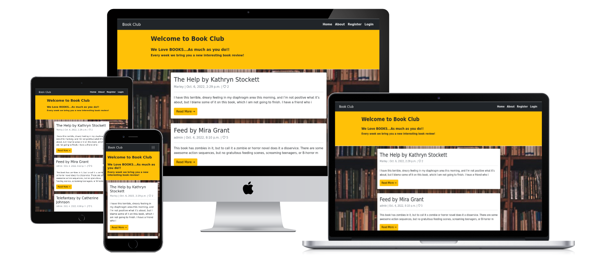

## Technologies used

### Languages

* [Python3](https://www.python.org/)
* HTML5
* CSS
* [JavaScript](https://www.javascript.com/)

### Frameworks, Libraries and other programs

* [Django](https://www.djangoproject.com/) framework (from Python)
* Django [Allauth](https://django-allauth.readthedocs.io/en/latest/installation.html) and [Crispy Forms](https://django-crispy-forms.readthedocs.io/en/latest/#) libraries
* [Gitpod](https://www.gitpod.io/) as IDE
* [GitHub](https://github.com/) to storage files
* [Bootstrap](https://getbootstrap.com/docs/5.2/getting-started/introduction/) for CSS package
* [Cloudinary](https://cloudinary.com/) to storage media
* [Heroku](https://www.heroku.com) for deployment
* [ElephantSQL](https://www.elephantsql.com/) for database
* [Favicon](https://favicon.io/) for favicon
* [Pexels](https://www.pexels.com/) for background image

## Resources

* [Code Institute](https://codeinstitute.net/ie/) - course materials, Slack community and tutor/mentor support
* [Boostrap docs](https://getbootstrap.com/) - for material support
* [Django central](https://djangocentral.com/) - for inspiration and material support
* [Codemy.com](https://www.youtube.com/c/Codemycom) - youtube channel for material support
* [W3 Schools](https://www.w3schools.com/) - for material support

## Credits

### Content

* Book reviews from [Goodreads](https://www.goodreads.com/) website.
* Book cover images from [Google](http://www.google.com)

## User Stories

### Agile Planning

The project was developed using agile methodologies, by delivering small features divided in 3 sprints - To do, In progress, Done.

Every card was labeled under User Stories, divided in User and Admin.

The board was created using Github projects and can be located [HERE](https://github.com/users/rlorimier/projects/3/views/1) to have access to more information on the project cards.

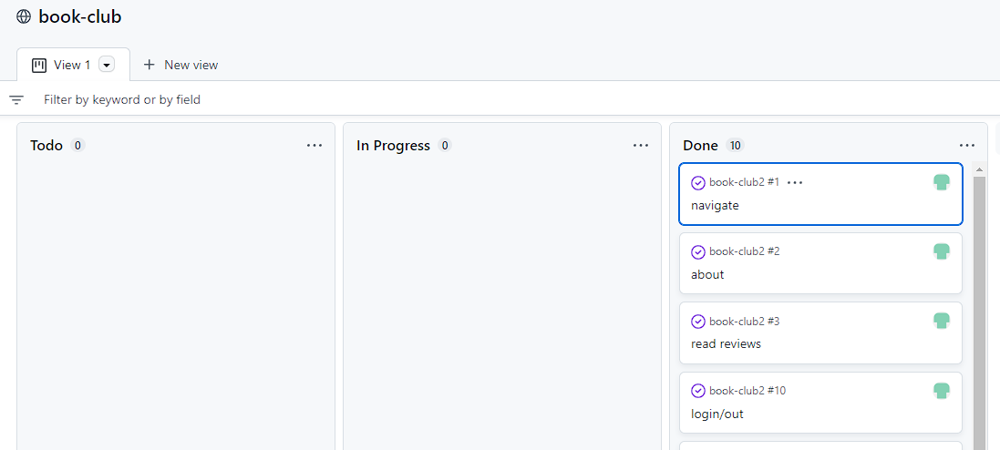

#### As Visitor:

* I want to be able to navigate through the website

* I want to know how the blog was created so I can learn more about the blog

* I want to read the book reviews so I can decide to read the book or not

* I want to be able to register so I can interact with the blog

#### As Registered User:

* I want to be able to login/out so I can interact with the blog

* I want to leave comments on the posts so I can leave my personal opnion

* I want to like the posts so I can tell other users that I like it

#### As Admin

* I want to write a new blog post so I can keep the blog updated

* I want to delete a blog post so I can remove unwanted posts

* I want to edit a blog post so I can amend it

## Features

### Favicon

A favicon was added the website to enable users to easily locate the website in the browser when multiple tabs are open.

### Code features

* Created in Django using Gitpod.
* Deployed in Heroku for online interaction.

### User features

* Home button, on the navigation bar at the top left, bringing the user back to the home page.
* About button, on the navigation bar at the top left, leading the user to a new page containing information about how the blog was created.
* Option to register/sign in on the blog clicking on the respective button from the navigation bar on the top left.

* Option to log out by clicking on the respective button from the navigation bar on the top left.

* Once registered/logged in, user can interact with the blog, leaving a new comment or like/dislike posts on the post page.

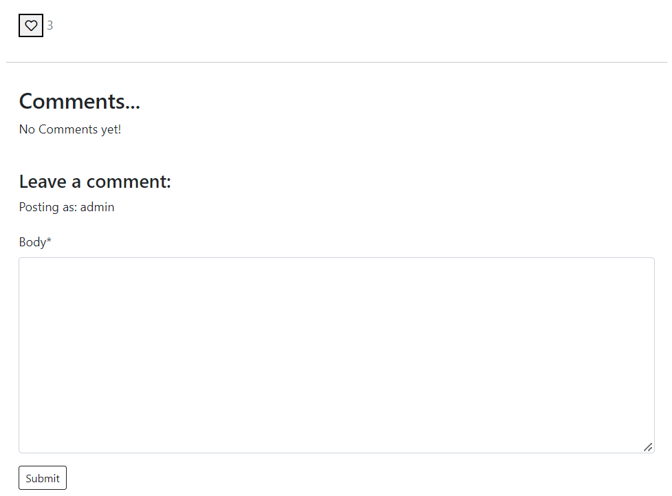

* Warning message is shown when user log in/out or leave a comment.

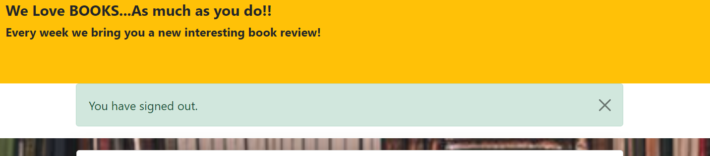

* Read more button, on botton of every post, giving the user the possibility of reading the full review.

* Edit/Delete button, option available only for superusers.

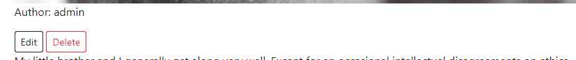

## Testing

### Manual Testing

* Manual tests done as admin user, regular user and visitant. In all scenarios the blog funcionalities worked without showing any issues.
* I also send the live link to friends and family members for testing and feedback.

### Code Testing

* Python - [PythonChecker](https://www.pythonchecker.com/)

All .py files were individualy tested, with the exception of settings.py, as some of the lines are longer than 79 characters but they are required for functionality of the website.

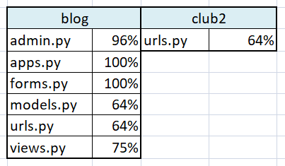

* HTML - [W3C](https://validator.w3.org/nu/)

W3C Validator shows one error on the HTML, however it cannot be fixed. The closing div tag mentioned is the one after the endblock content on base.html and if removed the css classes will not be applied.

* CSS - [Jigsaw](https://jigsaw.w3.org/css-validator/)

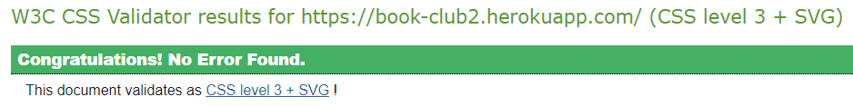

* JavaScript - [JSHint](https://jshint.com/)

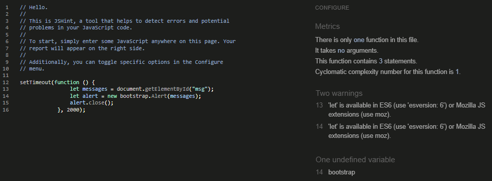

### Accessibility Testing

* Tested using [Accessibility Test](https://accessibilitytest.org/).  You can check the full test result clicking [HERE](https://accessibilitytest.org/results/YTL9u9vvs41X).
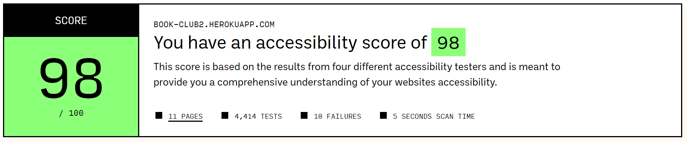

### Page quality measurement

Tested using [PageSpeed](https://pagespeed.web.dev/)

* On mobile views - Full results can be found [HERE](https://pagespeed.web.dev/report?url=https%3A%2F%2Fbook-club2.herokuapp.com%2F&form_factor=mobile)

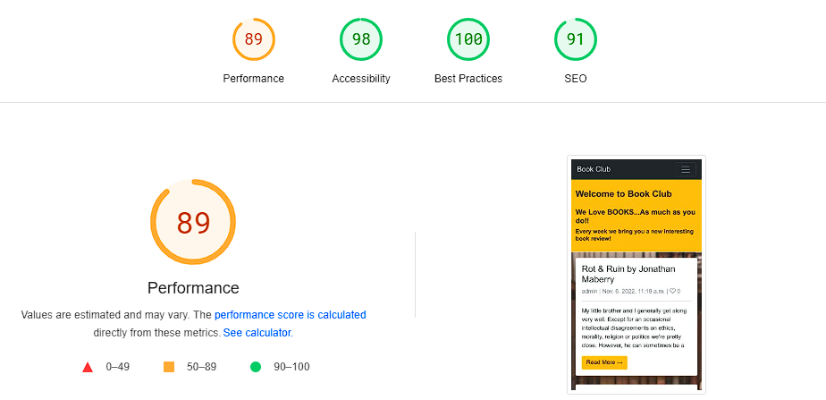

* On desktop views - Full results can be found [HERE](https://pagespeed.web.dev/report?url=https%3A%2F%2Fbook-club2.herokuapp.com%2F&form_factor=desktop)

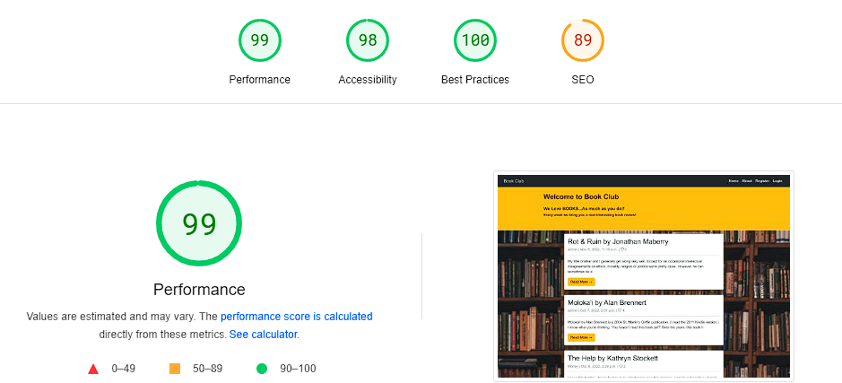

### Browser Testing

The site was tested and worked without any issues, using:
* Internet Explorer
* Google Chrome
* Microsoft Edge
* Firefox
* Samsung Internet

## Bugs/Issues *(from 1st repository)*

* Gitignore

When setting up all files and folders I forgot to include the .gitignore. So, when at some stage on my commitments I received and warning email from GitHub about my keys being exposed.  
*To Fix: No support needed - I just created a new file, added the necessary content on it and then commit/push to Github.*

* Login on Django Admin

When setting the supper user I was having trouble to access the Django Admin page. The url was returning an error message.  
*To Fix: Needed support from Tutor - The server was not running. I was told to run the server and use the url https://8000-rlorimier-bookclub-fa25pzry77q.ws-eu63.gitpod.io/admin/.*

* Hyperlinks not working

The pages were not extending the 'base.html'  
*To Fix: Needed support from Tutor - I was told to include on the top of every page 'load static' and it worked*

* New comment does not show

When adding a new comment (logged in and/or out), the page is reloaded and redirected correctly with no error messages, however the comment is not saved and does not appear on the website neither on the blog admin server.  
*To Fix: No support needed (although I tried to discuss this issue with my mentor but the time was not enough) - This is the issue that took longer to be solved. I searched on web for different tutorials but any of them seemed to be helpfull. After a while, I just needed to add 'data' on views.py, line 55*

* New post show error message

When adding a new post (only logged users), it shows and error message  
*To Fix: No support needed - I was using the same function for both, edit and create a new post. I decided to make it individualy and then it starts to work*

* GET /favicon.ico HTTP/1.1" 404 179

The terminal keeps showing this error from time to time and I can not find a solution or even where is comming from, as I did not add any favicon on the blog.   *BUG NOT FIXED*

* Push failed on Heroku

When pushing my gitpod project to Heroku, following the instructions for: DEBUG=False and excluding DISABLE_COLLECTSTATIC=1, an error message is shown. I tried help from my mentor and from the tutor support but none of them were able to help me to find a solution for it. So, I left the DEBUG as False on my code and added again the DISABLE_COLLECTSTATIC=1 and tried to puch my code again. The push worked this time, however the css file is not being loaded. All funcionalities seems to work fine on the manual tests, but the css.   *BUG NOT FIXED*

## Bugs/Issues *(from 2nd repository)*

* Error 500 when registering using an email

When the user is registering into the blog, if he adds his email and clicks on 'Register', the site returns the Error 500. 
*To Fix: Tutor help was needed. They instructed me to add two lines on settings.py. It creates a default email so if the user adds and nonexistent email or type it wrongly, the user will be registered anyway and redirected to the home page, with no errors.*

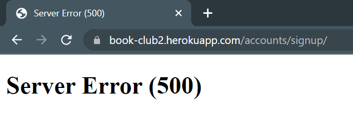

## Creating a Repository and Deploying

### GitHub / Gitpod

* To create a new repository:

  1. Logged in my GitHub page and accessed Code Institute GitHub page. 

  2. Selected python-essencials-template and clicked in Use This Template. 

  3. Created a new repository from the one mentioned above and choose the option 'Gitpod'. Once the repository is open on Gitpod it is just start to code. I chose the option to save automatically. 

  4. After every significant amount of coding is time for local commits: On Gitpot, go to Source Control, type in a message and click Commit. After a work day, the last local commit is done and then click in Push to commit all local commits to GitHub repository. 

### ElephantSQL

* Create Database

  1. Sign up for ElephantSQL.com to access your dashboard and click “Create New Instance”
  
  2. Set up your plan, give it a name and select the Tiny Turtle (Free) plan
  
  3. Click “Select Region”, select a data center near you and click "Review"
  
  4. Check your details are correct and then click “Create instance”
  
  5. Return to the ElephantSQL dashboard and click on the database instance name for this project
  
  6. In the URL section, clicking the copy icon will copy the database URL to your clipboard
  
  7. Open your Gitpod and, in the terminal, install dj_database_url and psycopg2, both of these are needed to connect to your external database
  
  8. Update your requirements.txt file with the newly installed packages
  
  9. In your settings.py file, import dj_database_url underneath the import for os
  
  10. Comment out your current database and add the new ElephantSQL database
  
  11. Migrate your database models to your new database and then load in the fixtures
  
  12. Create a superuser for your new database
  
  13. Delete the new database from your settings.py and uncomment your old database

### Heroku

* Create App

  1. Log in to Heroku and 'Create New App' from the dashboard

  2. Give your app a name and select the region closest to you. When you’re done, click Create app to confirm

  3. Add config vars to Heroku - go to Heroku Settings tab, click on Reveal Config Vars, and add environment variables described below in key/value pairs

     * DATABASE_URL - your database variable from ElephantSQL

     * SECRET_KEY - there are websites online that will help you generate random Django secret keys

     * CLOUDINARY_URL - your database variable from Cloudinary

* To Deploy:

  1. Navigate to the Deploy tab in Heroku and connect your app to GitHub.

  2. Deploy the branch manually.
  
  3. Check the build log for errors.
  
  4. Once Heroku completed the build process, you will see a 'Your App Was Successfully Deployed' message and a link to the live site.
  
  5. You can also choose to enable Automatic deploys.

